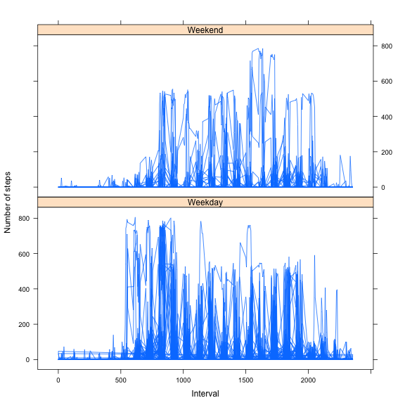

# Reproducible Research: Peer Assessment 1


## Loading and preprocessing the data

### Prepareation and Data Loading

```r
# Load the csv and parse the data strings as Dates
ac = read.csv("activity.csv", stringsAsFactors = FALSE)
ac$date = as.Date(ac$date)
```


### Define Helper Function


```r
# Define a function to plot a histogram of the steps variable of the passed
# dataset and print mean an median Since we do this more then once, this
# might as well be a function
view <- function(df) {
    hist(df$steps, xlab = "Steps per Day", main = "Histogram of Steps")
    cat("Mean: ", mean(df$steps, na.rm = TRUE), "Median: ", median(df$steps, 
        na.rm = TRUE))
}
```


## What is mean total number of steps taken per day?

### Look at the Steps Variable

Here I plot a histogram of the (unimputed) steps variable and print it's mean and median


```r
view(ac)
```

 

```
## Mean:  37.38 Median:  0
```


### Plotting the Steps

Plotting the number of steps by data


```r
plot(ac$date, ac$steps, type = "l", ylab = "Number of Steps", xlab = "Date")
```

 


## What is the average daily activity pattern?


### Finding the Intervall with the most steps taken


```r
# calculate the mean steps by intervall
step_by_interval <- tapply(ac$steps, ac$interval, mean, na.rm = TRUE)
# sort by average, and return the highest elements and its name, this is the
# index
max_inter <- tail(sort(step_by_interval), n = 1)
cat("Highest interval is", names(max_inter), " with value ", max_inter)
```

```
## Highest interval is 835  with value  206.2
```


## Getting the number of Incomplete Cases

There are some incomplete cases in the dataset


```r
sum(!complete.cases(ac))
```

```
## [1] 2304
```


## Imputation for Mising Step Values

The following is a simple imputation that assigns the median of steps for all missing values.
I do a copy of the dataset before.


```r
ac_complete <- ac
ac_complete$steps[is.na(ac_complete$steps)] <- median(ac$steps, na.rm = TRUE)
```


### View the Imputed Dataset

Showing the imputed dataset.


```r
view(ac_complete)
```

 

```
## Mean:  32.48 Median:  0
```


## Are there differences in activity patterns between weekdays and weekends?

### Creation of the 'is_weekend' Helper Variable

I use a help function to check if a day is a weekday to make things more readable, then I use this function to add a new variable to the imputed activity dataset. I use Strings to make ploting nicer later on and 
then transform to a two-level factor


```r
test_weekend <- function(day) {
    weekdays(day) %in% c("Saturday", "Sunday")
}

ac_complete$is_weekend <- as.factor(ifelse(test_weekend(ac_complete$date), "Weekend", 
    "Weekday"))
```


### Ploting Steps on Weekdays versus Weekends

Finally, a lattice plot shows the number of steps by intervall for weekdays and weeks.  There are some difference in activity patterns on the weekend. People sleep longer.


```r
#Load lattice libary
library(lattice) 
xyplot(
    steps~interval | is_weekend,  # Plot steps against intervall, one plot for value of is_weekend
    ac_complete,
    type='l', # Lineplot
    layout=c(1,2), # Layout is stacked
    ylab="Number of steps",
    xlab="Interval"
)
```

 

